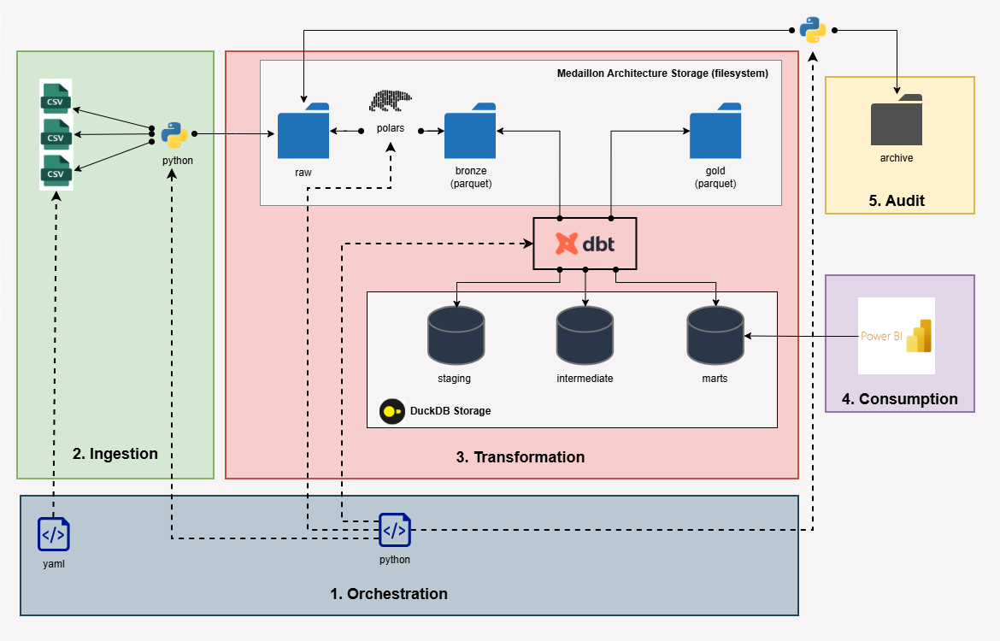

# Multi-Layered ELT Pipeline: Portfolio Valuation with Polars, dbt, and DuckDB

## 🎯 Project Overview
This project demonstrates a **professional-grade ELT (Extract, Load, Transform)** pipeline designed to handle financial portfolio data. The system is built upon two core pillars:

1.  **The Medallion Architecture:** Providing a clear, tiered structure to transform raw transaction data into clean, business-ready analytics through Bronze, Silver, and Gold layers.
2.  **Modern Data Architecture (MDA):** Utilising a "Best-of-Breed" approach that decouples data ingestion, transformation logic, and storage. By using **Polars** for high-performance ingestion and **dbt (Data Build Tool)** for modular SQL transformations, the architecture ensures that every transformation is version-controlled, tested, and fully documented. This combination allows the pipeline to remain scalable, auditable, and database-agnostic by design.

The pipeline was initially developed as a high-performance **Proof of Concept (PoC)** using **DuckDB** for local speed and portability. While the dbt pipeline was successfully implemented and validated, the final interface with **Power BI** highlighted the requirement for robust multi-user access and enterprise-grade concurrency.

The "magic" of this **Modern Data Architecture** is that moving from a local DuckDB file to a **PostgreSQL** instance is a seamless next step. Because the ingestion and business logic are strictly decoupled from the storage engine, the stack can be migrated with minimal effort—demonstrating how a well-architected PoC can evolve into a production-scale system without a total rewrite.

## 📋 Engineering Requirements

The architecture was designed to meet a specific set of functional and non-functional constraints, ensuring the system is both powerful for the user and sustainable for the developer.

### 🔹 Functional Requirements
* **Multi-Source Consolidation:** Automatically aggregate and harmonize data from diverse investment vehicles, including **Pension**, **ISA**, and **General Investment Accounts (GIA)**.
* **Global Performance Indicators:** Calculate unified metrics across all accounts, specifically:
    * **Rate of Return (RoR):** Time-weighted performance tracking.
    * **Total Principal vs. Current Value:** Real-time visibility of total capital at risk.
    * **Financial Forecasting:** Projected valuations based on historical contribution patterns and growth assumptions.
* **Data Archiving & Audit:** Automated preservation of raw source files for historical auditing and reconciliation.

### 🔹 Non-Functional Requirements
* **Zero-Cost Infrastructure:** The entire stack must run using free or open-source local installations (DuckDB, Polars, dbt-core).
* **Rapid PoC Prototyping:** The environment must support near-instantaneous development loops with no cloud latency.
* **Scalability & Migration Path:** The logic must be decoupled from the database (**MDA approach**) to allow a "lift-and-shift" migration to a multi-user, enterprise-grade environment (e.g., PostgreSQL or Cloud Data Warehouse) without rewriting business logic.
* **Data Contract Enforcement:** The pipeline must validate incoming file schemas (via `config.yaml`) to ensure stability before processing begins.

## 🏗️ Strategic Tool Selection & Architectural Rationale

The following table outlines the deliberate choices made to ensure the system is modular, auditable, and ready for future scale.

| Architecture Step | Tool | Justification |
| :--- | :--- | :--- |
| **Ingestion** | **Polars** | Chosen for its Rust-based speed and multi-threaded processing; provides enterprise-level performance on local hardware. |
| **Storage (PoC)** | **DuckDB** | An "in-process" database allowing for ultra-fast development with zero infrastructure costs or maintenance overhead. |
| **Transformation** | **dbt-core** | The industry standard for SQL transformation, offering version control and automated testing in a free, open-source package. |
| **Orchestration** | **Python** | Acts as the "glue" for the pipeline, providing full control over file archiving and workflow automation without expensive licensing. |
| **Consumption** | **Power BI** | Leveraged for its robust free tier and widespread enterprise adoption, ensuring final insights are accessible and professional. |
| **Governance** | **dbt & Python** | dbt manages data lineage and documentation, while Python ensures auditability through automated raw file archiving. |

### 💡 Why this Stack?
The tool selection for this project was driven by a **"Cloud-Ready, Local-First"** philosophy. This approach offers several strategic advantages:

* **Zero Infrastructure Cost:** Every tool used is available in a free or open-source version, making it ideal for home development or rapid prototyping without a massive initial investment.
* **Rapid Development Cycle:** By using local-first tools like DuckDB and Polars, the developer loop is near-instantaneous. There is no "waiting for the cloud" to spin up or for data to transfer over the network.
* **Enterprise Standards:** Despite being free, these tools are the current industry standards. dbt-core and Polars are used by top-tier data teams globally, ensuring the project remains professional-grade.
* **Seamless Scalability:** The architecture is designed to "lift and shift". Because we use dbt and Polars, migrating from a local environment to a cloud provider (e.g., Snowflake, BigQuery, or AWS) is a configuration change rather than a code rewrite.